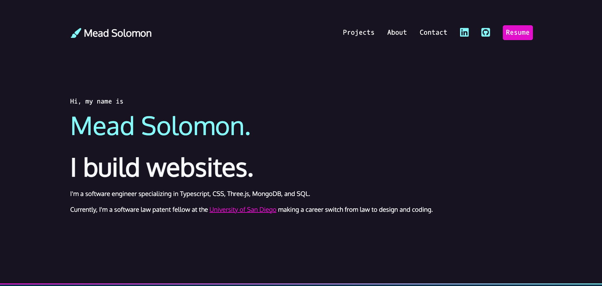

# CSS Portfolio

This portfolio features stylized text, CSS gradients, navigation bars, and semantic HTML. In addition, responsive styling makes this site look great on both desktop and mobile devices.

## Table of Contents:

1. Demo
2. Further Improvements

## Demo

👉 <a href="meadsolomon.com" target="_blank">Deployed Link</a>   

## Further Improvements

- Add a CSS-only hamburger button, a CSS-only dropdown, or both to the navbar.
- Add a contact form to the site rather than an email button.
- Expand the projects section. Rather than presenting all project information on the home page, present an overview and a link to more extensive details and links as an additional page.
